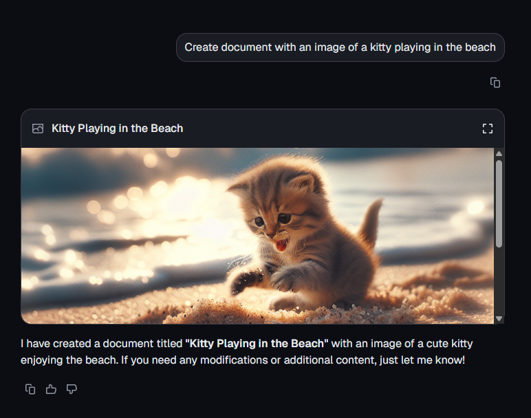
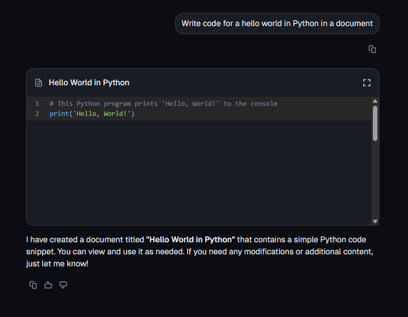
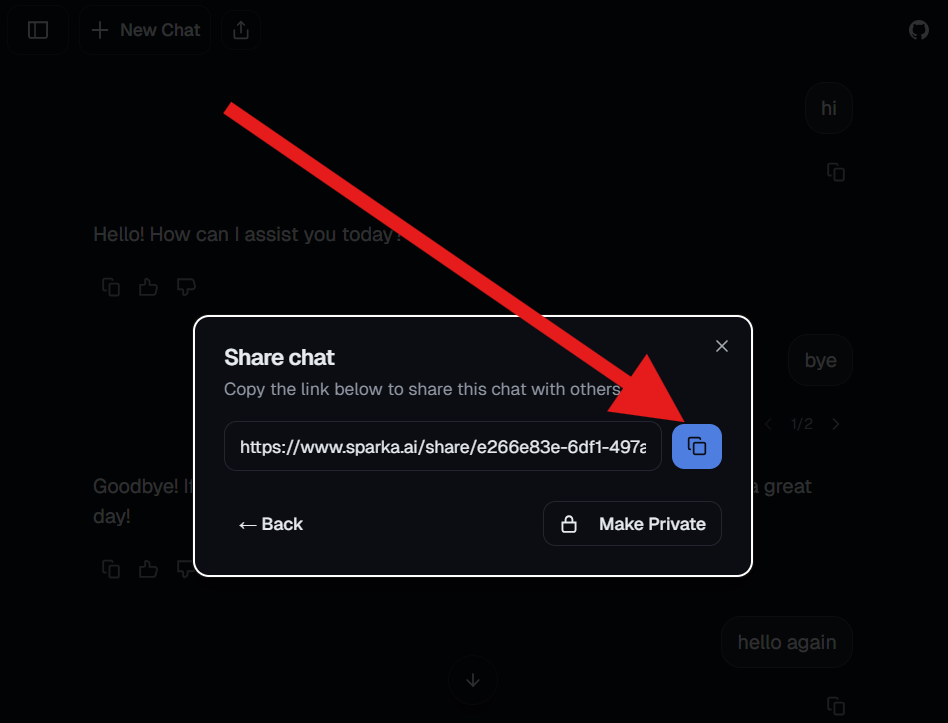
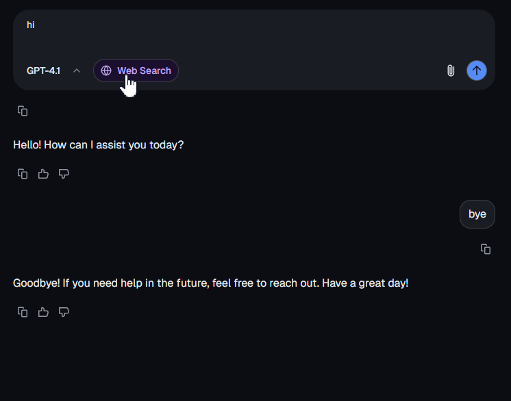

# Testing Instructions for Sparka Features

This document provides comprehensive testing instructions for all major features in the Sparka chat application.

## Prerequisites

1. Go to `sparka.ai` and login with GitHub / Google

Or 

1. Fill out ENV variables in .env.example (There are lots of them)
2. bun i
3. bun dev
4. Go to http://localhost:3000

## 1. Attachment Support

### Image Uploads (PNG, JPEG)
1. Click the paperclip/attachment icon or drag-and-drop in the chat input
2. Test multiple uploads
3. Verify image previews appear in input area
4. Test removing individual attachments before sending
5. Send message with prompt: "What's in the image?"

**Example:** https://www.sparka.ai/share/6dd8f1d7-57d1-4f1c-8a44-30f04f09eb95

### PDF Uploads
1. Click the attachment icon or drag-and-drop in the chat input
3. Verify PDF preview appears
4. Send message with prompt: "What's in the PDF?"
5. Verify PDF can be opened/viewed in chat

**Example:** https://www.sparka.ai/share/2c8f35d3-67bc-4eec-8351-04eb2904d6a0

## 2. Image Generation

### AI Image Creation
1. Send prompt: "Create document with an image of a kitty playing in the beach" (sorry, there's a bug in routing and it considers images as documents)
2. Verify AI generates and displays image correctly

**Example:** https://www.sparka.ai/share/3c69ed0f-249f-4d5b-a824-6e2458c6ccd7

## 3. Syntax Highlighting

### Code Formatting
1. Send prompt: "Write code for a hello world in Python in a document" (Only Python supported for highlights)
2. Verify syntax highlighting appears correctly

**Example:** https://www.sparka.ai/share/9f1fc4b1-e738-4337-9344-f433a82b62f4

## 4. Resumable Streams

### Stream Continuation
1. Start a conversation that generates a long response
   1. Prompt example: "Write 200 words, one per line, start each with a number"
2. Refresh the page mid-generation
3. Verify the response continues from where it left off

## 5. Chat Branching

### Alternative Conversation Paths
1. In an existing conversation, edit any user message
2. Switch between branches using the branch selector
3. Navigate between different branches of the same conversation
5. The last message received is displayed when conversation loads
6. Messages are attached to the correct branch

**Example:** https://www.sparka.ai/share/e266e83e-6df1-497a-9b86-710e729e55b5

## 6. Chat Sharing

### Share Link Generation
1. Click the share button in a conversation or sidebar history
2. Copy the generated share link

### Share Link Access
1. Open share link in new browser/incognito window
2. Verify conversation is viewable and read-only
3. Test saving conversation as logged-in user
4. Test saving conversation as anonymous user

**Example:** https://www.sparka.ai/share/e266e83e-6df1-497a-9b86-710e729e55b5

### Share Link Management
1. Test disabling/revoking share links
2. Verify revoked links no longer work
3. Test link permissions

## 7. Web Search

### Real-time Web Search
1. Enable web search toggle in the interface
2. Ask questions requiring web search:
   - "What's the latest news about AI?"
   - "What's the weather in New York today?"
   - "What are the current stock prices for tech companies?"
3. Open the search info panel (above assistant message)

**Example:** https://www.sparka.ai/share/5f5c1376-d41c-4d5b-bfe8-c304f5c4f7e1

### URL Processing
1. Send prompt: "What's https://cloneathon.t3.chat?"
2. Verify URL content is processed correctly

**Example:** https://www.sparka.ai/share/bcc91bb0-d255-4d2b-ac9a-d6a839f6248e

## 8. Message Editing Plus

### Edit Message
1. Click on any sent message
2. Verify edit interface appears
3. Test modifying:
   - Message content
   - Attachments (add/remove/modify)
   - Model selection
   - Search toggles (web search, deep research)
4. Save changes and verify conversation updates correctly
5. Confirm response regenerates with new parameters

